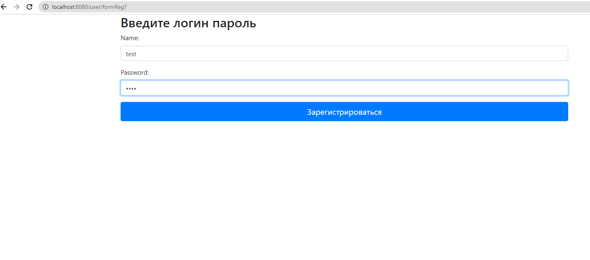
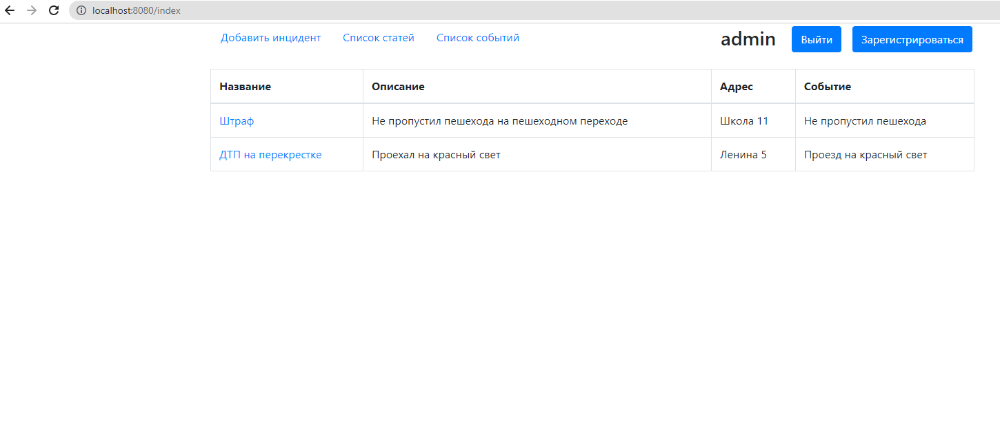
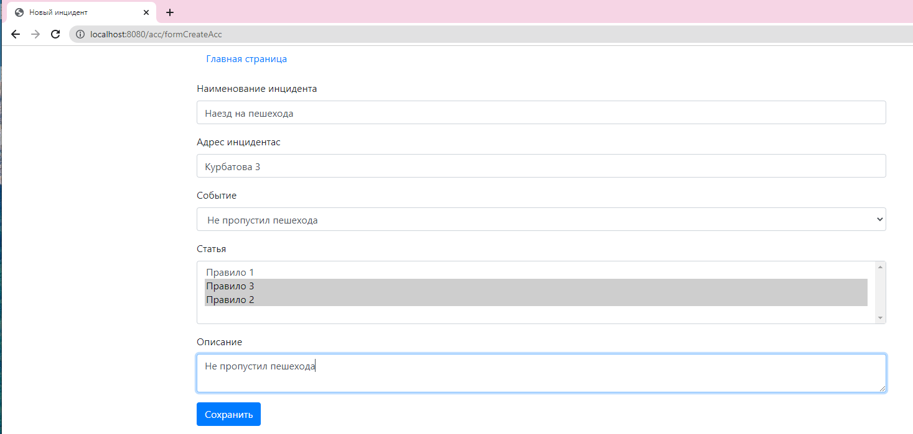
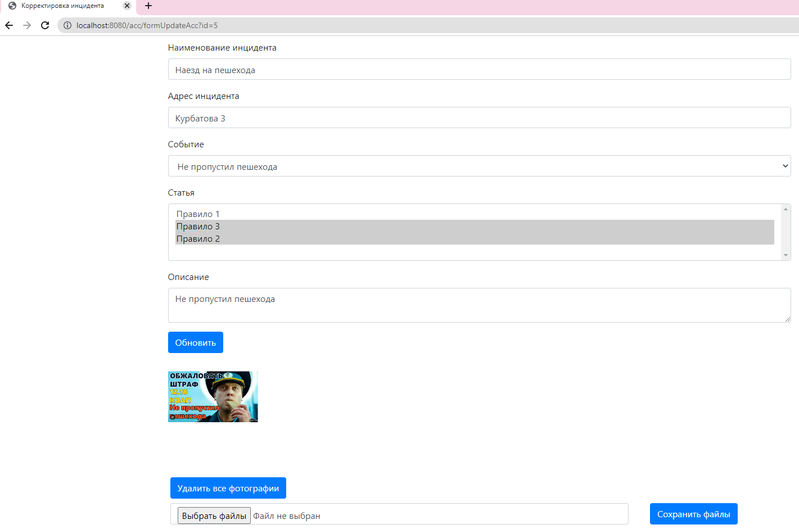
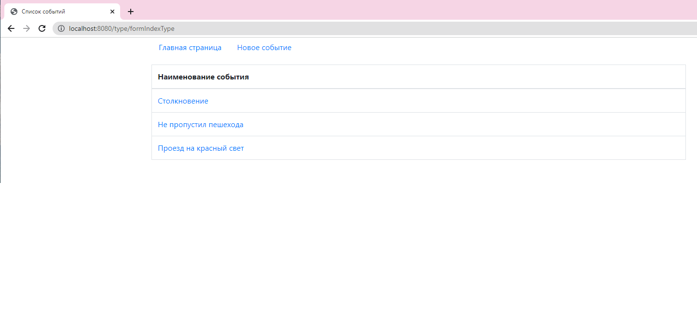
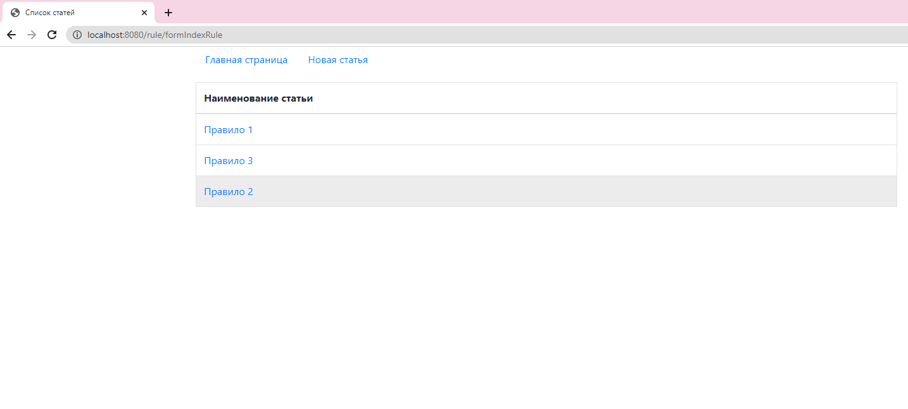

[](https://app.travis-ci.com/bespalov0928/work_car_accident_V2)
### О проекте
Проект - Автонарушители
В системе существуют две роли (пользователь, автоинспектор).
Пользователь создает заявление правонарушения.
В заявлении указывает: адрес, тип инцидента, описание нарушения.

### Стек технологий
* Java 17
* Spring Boot
* Spring Security
* PostgreSQL
* Liquibase
* Thymeleaf
* Jacoco
* Travic
* Lombok
* Checkstyle 

### Сборка и запуск
Сборка
```
mvn install
```
запуск
```
копирование файла из target\work_car_accident.war в папку apache-tomcat-9.0.44\webapps
запуск tomcat - apache-tomcat-9.0.44\bin\startup.bat
```

### Как использовать
Регистрация нового пользователя


Авторизация пользователя


Главная страница


Добавление инцидента


Редактировние инцидента


Типы инцидентов


Правила


### Контакты
Skype: bespalov0928